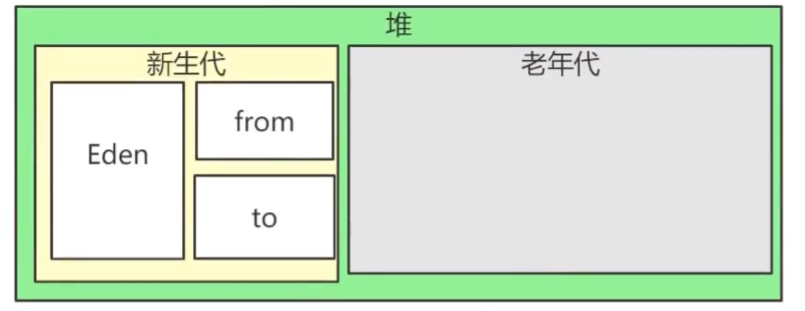

# 堆和垃圾回收

## 一、堆

### 1.1 新生代和老年代的交替

新生代和老年代是 1:2
Eden区和from和to 8:1:1

对象生成在Eden区，Eden区满了之后，触发minor GC，从gc root遍历全部对象，如果没有引用则回收内存，有引用则移入from

每次判定回收时，存活的对象的age+1，from区满了以后进行垃圾回收，将from区存活的对象移动到to区，from区和to区转换

age=15直接进入老年代

老年代满了以后进行full gc ,full gc 会引起STW ，使用分代回收为了减少STW的次数、

### 1.2 判断一个对象是否需要回收
1. 引用计数法  
循环引用会造成计数永远达不到0，所以JVM不使用引用计数法
2. 可达性分析  
以GC Roots为起点进行搜索，可达的对象都是存活的，不可达的对象可被回收。GC Roots一般包括：  
   * 虚拟机栈中局部变量表中引用的对象
   * 本地方法栈JNI中引用的对象
   * 方法区中类静态属性引用的对象
   * 方法区中的常量引用的对象
3. 此外，方法区的回收收益很低，因为这里的对象都是永久代的。这里的回收一般是对常量池的回收和对类的卸载。
类卸载的必要条件：
   * 所有实例已回收
   * 加载该类的类加载器ClassLoader已回收
   * 该类的Class对象没有被引用，无法通过反射访问该类方法。
4. finalize()
finalize可以使对象在被回收时自救，且仅一次。

## 二、引用类型
### 强引用
new一个新的实例，类对象不会被回收
### 软引用
SoftReference类创建软引用，在内存不够时回收
### 弱引用
WeakReference类创建弱引用，只能存活到下次垃圾回收之前
### 虚引用
PhantomReference类创建虚引用。主要作用跟踪对象被垃圾回收的状态

## 三、垃圾回收算法

### 3.1 标记清除
产生内存碎片
### 3.2 标记整理
效率比较低
### 3.3 复制
Eden和Survivor就采用了复制的办法，Eden满了之后，将Eden和Survivor存活的复制到另一个Survivor上，再一次Eden满了之后，整理复制到另一个Survivor上。如果超出了Survivor的承受范围，要借用老年代空间。
### 3.4 分代收集
* 新生代：复制算法
* 老年代：标记整理或者标记清除

## 四、垃圾回收器
HotSpot中有7个垃圾回收器
### 4.1 Serial收集器
单线程，简单高效。Client的默认新生代收集器
### 4.2 ParNew收集器
Serial的多线程版本，Server场景下的默认新生代收集器，只有ParNew和Serial可以和CMS结合使用
### 4.3 Parallel Scavenge收集器
多线程，吞吐量优先。适合不需要交互的情景。其他收集器缩短了停顿时间，是牺牲了吞吐量和新生代空间换来的，垃圾回收频繁，总的吞吐量下降。
### 4.4 Serial Old收集器
Serial的老年代版本
### 4.5 Parallel Old收集器
Parallel Scavenge的老年代版本
### 4.6 CMS收集器
流程：初始标记、并发标记、重新标记、并发清除
有点：和用户线程并发进行，停顿时间很短
缺点：吞吐量低，无法处理浮动垃圾——用户线程在用的即将失效的垃圾，使用标记清除，会出现空间碎片化。
### 4.7 G1收集器
服务端的垃圾收集器，G1可以一起回收新生代和老年代。

## 五、OOM

内存溢出

### 原因

堆：内存泄漏（java不常见，除非代码很烂）
虚拟机栈：死循环，深度递归
方法区：大量class信息，还有反射会占用方法区

### 排查

1. java自带命令工具
	- jps
	- jstack：主要用来查看某个Java进程内的线程堆栈信息
	- jmap： jmap导出堆内存，然后使用jhat来进行分析
2. MAT工具可视化，图表化分析jstack dump文件的内容

### 解决

设置大内存

优化代码逻辑及数据结构