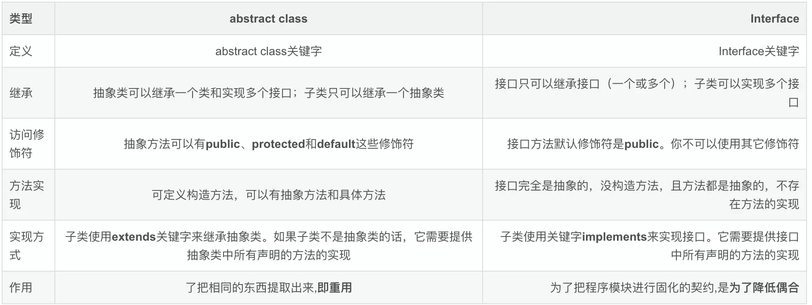

# 抽象类和接口
## 抽象类
1、抽象类使用abstract修饰；  
2、抽象类不能实例化，即不能使用new关键字来实例化对象；  
3、含有抽象方法（使用abstract关键字修饰的方法）的类是抽象类，必须使用abstract关键字修饰；  
4、抽象类可以含有抽象方法，也可以不包含抽象方法，抽象类中可以有具体的方法；  
5、如果一个子类实现了父类（抽象类）的所有抽象方法，那么该子类可以不必是抽象类，否则就是抽象类；子类如果是实现类必须实现父类的所有的抽象方法；  
6、抽象类中的抽象方法只有方法体，没有具体实现；

通俗的讲，就是面对一些拥有共同特征的类，可以从中提取出这些特征构成这个类。比如狗的种类不同，但是都是眼睛耳朵鼻子嘴巴尾巴，至于长短胖瘦，什么颜色，都是要到具体的实现类里去定义。
### 那这个抽象类的作用是什么呢？
1. 用于隐藏
对类型进行隐藏，我们可以构造出一个固定的一组行为的抽象描述，一个行为可以有任意个可能的具体实现方式。这个抽象的描述就是抽象类。（参考多态）

2. 用于拓展对象的行为功能
这一组任意个可能的具体实现表现为所有可能的子类，模块可以操作一个抽象类，由于模块依赖于一个固定的抽象类，那么他是不允许修改的。同时通过这个抽象类进行派生，拓展此模块的行为功能。（参考开放闭合原则）

## 接口
1、接口使用interface修饰；  
2、接口不能被实例化；  
3、**一个类只能继承一个类**，但是可以实现多个接口；  
4、接口中方法**均为抽象方法**；【java8可以有方法实现】  
5、接口中不能包含实例域或静态方法（静态方法必须实现，接口中方法是抽象方法，不能实现）【java8可以有静态方法】

接口就是一种特殊的abstract class，但是比abstract class更加抽象。
### 那么接口的作用是什么呢？
1、Java单继承的原因所以需要曲线救国，作为继承关系的一个补充。  
2、把程序模块进行固化的契约，降低偶合。把若干功能拆分出来，按照契约来进行实现和依赖。（依赖倒置原则）  
3、定义接口有利于代码的规范。（接口分离原则）  

## 抽象类和接口的区别
### 相同点
1. 都不能被实例化。
2. 接口的实现类和抽象类的子类只有全部实现了接口或者抽象类中的抽象方法后才可以被实例化。

### 不同点
首先看一张图

- abstract class 表示的是is a关系，interface表示的是like a关系。
- 抽象类强调的是从属关系，接口强调的是功能。
从设计层面来说，**抽象是对类的抽象**，是一种模板设计，而**接口是对行为的抽象**，是一种行为的规范。
- 抽象类可以有main方法，并且我们可以运行它，接口不能有main方法；
- 抽象类有构造方法，接口没有；
- 使用抽象类时添加一个新的实例方法时，不需要修改子类；而为接口增加方法时，其所有实现类都要修改；【java8降低了接口维护成本】
- **在需要复用父类提供的一些基本代码，并且另外有部分代码需要子类实现时可以使用抽象类**，它就像一个类的模板，如jdk中的aqs抽象类；**如果要实现多继承那就必须使用接口**;

## 继承关系
public：公开  
protected：子类可见  
无：包级可见  
private：本类可见

里氏替换原则