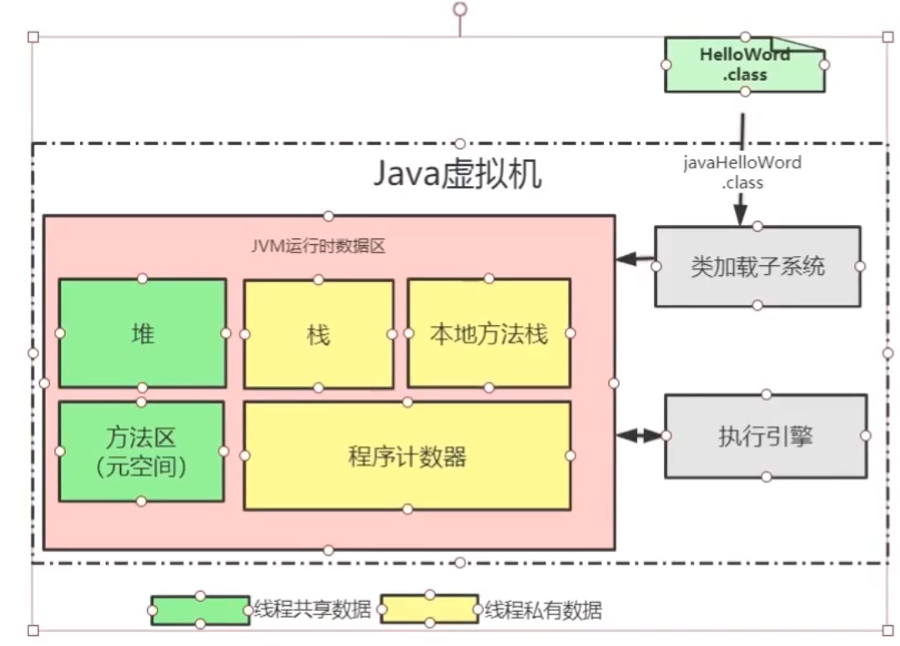
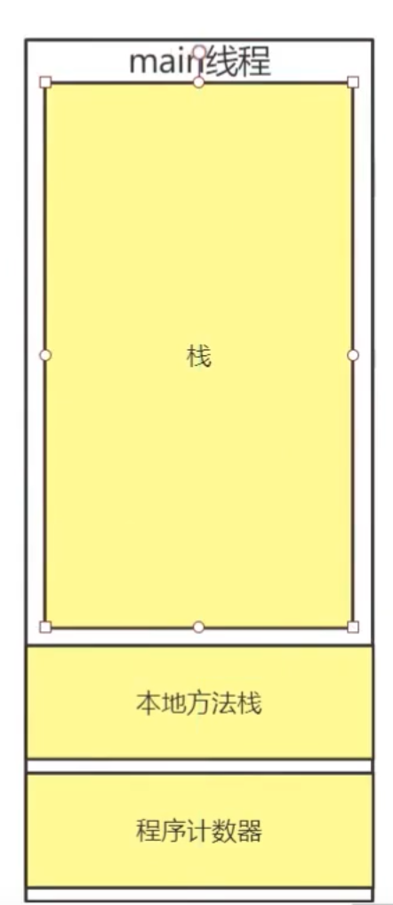

# java虚拟机

## 一、JavaSE结构图


* JRE：运行环境包
* JDK：包括JRE，多了一些java工具api
* JVM：在操作系统上运行java的虚拟机（实现了**跨平台**）

*.java(源码文件) -> *.class(字节码文件/可以跨平台) -> java虚拟机从软件层面屏蔽了底层硬件指令的细节 -> linux/windows不同的指令（对应不同的JVM） -> 操作系统识别机器码（0100111……） 运行过程

### 1.1 和C/C++跨平台的区别

C/C++在源码到字节码的过程中实现跨平台的，要适用不同平台的类库。编译过程

### 1.2 JVM底层实现
 
**JVM运行时数据区域**--必考

线程共享部分可能会出现线程不安全的问题

```java *.class``` 命令通过 *类加载子系统* 将程序加载到虚拟机中黄色区域。


#### 1.2.1 栈和程序计数器
栈>数据结构>FILO:
每一个方法都是一个栈帧，运行的方法放在栈中，不同的方法用不同的栈帧，目的可以**隔离不同范围的变量**，局部变量。方法的执行就是栈帧的入栈和出栈。
栈帧中包括：局部变量表、操作数栈、方法出口、其他信息。

程序计数器：指向当前线程所执行的字节码指令的（地址）**行号**

JDK中javap对字节码文件进行反汇编，得到包括**行号**的JVM指令集的java文件，效力等同于java文件，是JVM可以识别的程序


##### 1.2.1.1 JVM常用指令
|JVM指令|说明|
|---|---|
|iconst_1|int型常量值1进操作数栈|
|bipush|将一个byte型（8位带符号）常量值推送至栈顶|
|iload_1|第二个int型局部变量进操作数栈，从0开始计数|
|istore_1|将操作数栈顶int型数值存入第二个局部变量（表），从0开始计数|
|iadd|栈顶两int型数值相加，并且只保留结果进栈|
|imul|栈顶两int型数值相乘，并且只保留结果进栈|
|ireturn|从方法中返回int类型的数据，通过方法出口赋值到函数调用的位置|
|return|当前方法返回void|
|getstatic|获取指定类的静态域，并将其值压入栈顶|
|putstatic|为指定的类的静态域赋值|
|invokevirtual|调用实例方法|
|invokespecial|调用超类构造方法、实例初始化方法、私有方法|
|invokestatic|调用静态方法|
|invokeinterface|调用接口方法|
|new|创建一个对象，并且其引用进栈|
|newarray|创建一个基本类型数组，并且其引用进栈|
|||

函数创建的对象存储在**堆**中，栈帧中对象名引用指向堆中的这个对象

#### 1.2.2 本地方法栈：
执行被native修饰的方法，和栈在使用上没有区别。
native方法主要用于加载文件和动态链接库，由于Java语言无法访问操作系统底层信息（比如：底层硬件设备等），这时候就需要借助C语言来完成了。被native修饰的方法可以被C语言重写。使用了native修饰的方法一般移植性不高

#### 1.2.3 方法区（元空间）：
存储的是类的信息，同一个类的对象指向同一个元空间存储的信息（class的信息）

#### 1.2.4 堆：
见堆和垃圾回收

### 1.3 JVM调优
