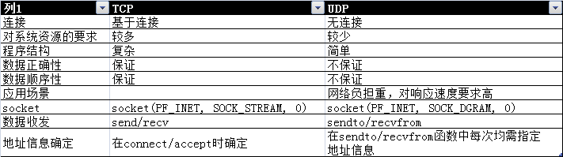

# Socket连接

## Socket服务端
1. 创建Socket对象
2. bind服务器ip和端口
3. listen进行侦听连接
4. accept获取客户端的数据请求（Listen到accept进行了三次握手）
5. recv获取数据
6. send发送数据给客户端
7. 回到4进行等待或
8. close断开连接（四次挥手）

## Socket客户端
1. 创建Socket对象
2. bind是可选的
3. connect进行服务端连接请求
4. send向服务器发送请求
5. recv获取服务器返回的数据

